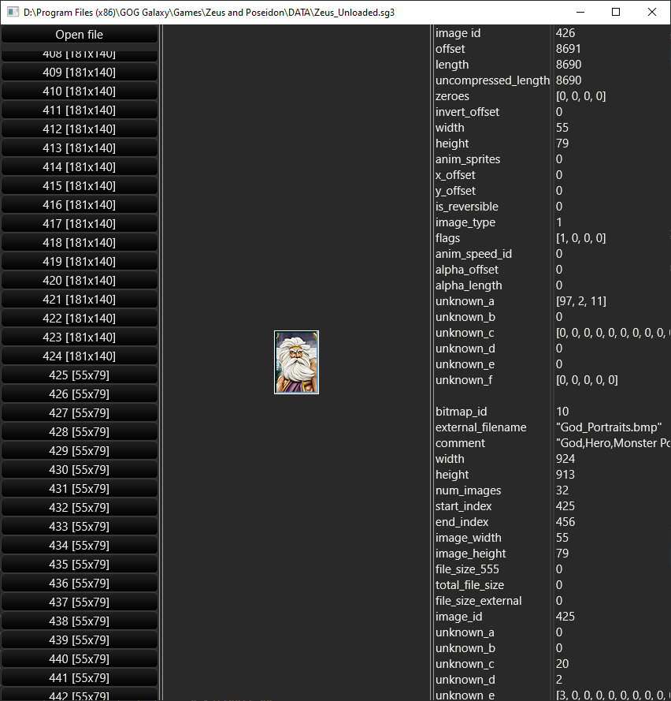

# sg-reader

[](https://github.com/zawapl/sg-reader/blob/main/LICENSE)

A library for reading sg3 files used in Sierra city building games (Cesar 3, Pharaoh, Zeus, Emperor). Inspired by https://github.com/lclarkmichalek/sgreader.

Documentation of the format can be found at https://github.com/bvschaik/citybuilding-tools/wiki/SG-file-format#image-data.

Basic usage:
```rust
// Load metadata contained in the specified file
let sg_file: SgFileMetadata = sg_reader::SgFileMetadata::load_metadata(path)?;

// Load pixel data for all images listed in that file
let images_raw_bytes: Vec<Vec<u8>> = sg_file.load_image_data(&sg_reader::VecImageBuilderFactory)?;
```

The raw bytes can be used to construct required image structs. It is also possible to construct the required structs directly by implementing the `ImageBuilderFactory` trait and passing it instead of the `VecImageBuilderFactory`.

Pixel data can also be loaded for one image at a time, see `custom_reader` example
```rust
// Image we want to laod pixel data for
let image = &sg_file.images[11];

// Get the path of the file where that data is located
let path = sg_file.get_555_file_path(image.bitmap_id as usize, image.is_external());

// Create a new reader
let mut buf_reader = BufReader::new(File::open(path)?);

// Load pixel data for that specific image
let pixel_data = image.load_image(&mut buf_reader, &VecImageBuilderFactory);
```

## Viewer example

You can run `cargo run --example viewer` to open up an example application for viewing the files:



---

Currently, only tested with Zeus files.